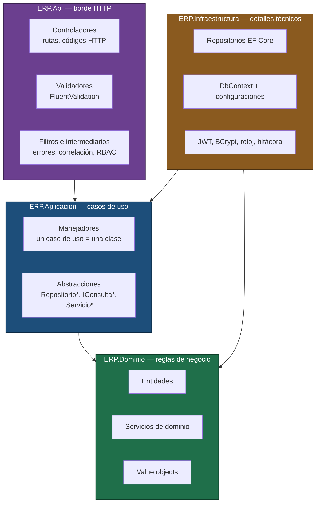
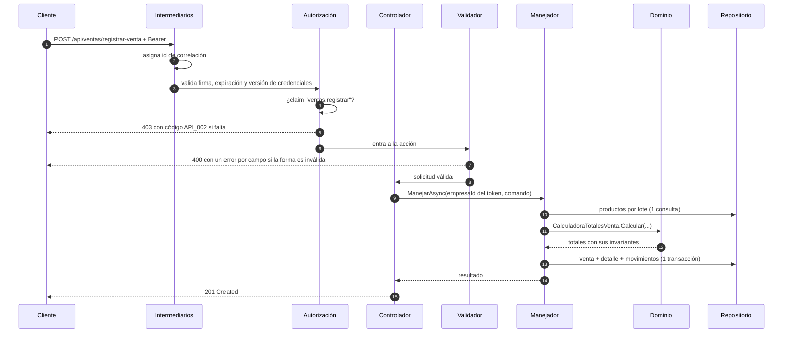

# ERP Modular — arquitectura de referencia en .NET 8

> Réplica genérica y ejecutable de la arquitectura de un ERP multiempresa que diseñé y
> construí, y que hoy corre en producción. **No contiene código, datos ni reglas de negocio
> del cliente**: es la estructura, las convenciones y las decisiones técnicas, aplicadas a un
> dominio genérico, con un módulo simple y un módulo complejo implementados de punta a punta.

Si llegaste desde mi portafolio y quieres ver cómo construyo un sistema completo, este
repositorio está pensado para recorrerse en quince minutos. Empieza por
[**qué mirar primero**](#qué-mirar-primero).

---

## Qué es esto

Una API REST multiempresa sobre **.NET 8**, organizada en cuatro capas con dependencias
dirigidas hacia el dominio, más un proyecto de pruebas. Clona, `docker compose up`, y tienes
la API corriendo con base de datos, datos de ejemplo y Swagger.

| | |
|---|---|
| **Plataforma** | .NET 8 / ASP.NET Core |
| **Persistencia** | SQL Server + EF Core 8, migraciones SQL versionadas |
| **Seguridad** | JWT (acceso + refresco con rotación), RBAC por permisos `modulo.accion`, BCrypt |
| **Validación** | FluentValidation, con códigos de error de catálogo |
| **Pruebas** | xUnit + NSubstitute + FluentAssertions |
| **Entrega** | Dockerfile multietapa, docker compose, GitHub Actions |
| **Documentación** | Swagger/OpenAPI + [`docs/`](docs/README.md), con ADR por decisión |

### El sistema real del que sale esta estructura

Los números ayudan a dimensionar por qué la arquitectura es la que es:

| Métrica | Sistema en producción |
|---|---|
| Líneas de C# | ~58.000 en 1.070 archivos |
| Módulos funcionales | 31 |
| Endpoints REST | ~185 |
| Controladores | 36 |
| Entidades de dominio | 41 |
| Pruebas automatizadas | 47 archivos de tests |

Una solución de ese tamaño no se sostiene por disciplina individual: se sostiene porque las
reglas están **forzadas por la estructura**. Ese es el tema de este repositorio.

---

## Qué mirar primero

Seis archivos, en este orden, cuentan la historia completa:

1. **[`ERP.Api/Program.cs`](ERP.Api/Program.cs)** — la composición del sistema. El orden del
   pipeline está comentado línea por línea, porque invertir dos de esas líneas es la forma más
   rápida de dejar una API abierta.
2. **[`ERP.Dominio/Servicios/CalculadoraTotalesVenta.cs`](ERP.Dominio/Servicios/CalculadoraTotalesVenta.cs)** —
   un servicio de dominio puro, con sus invariantes escritas y
   [sus pruebas](ERP.Tests/Ventas/CalculadoraTotalesVentaTests.cs). Es donde un ERP pierde
   plata en silencio si el diseño es flojo.
3. **[`ERP.Aplicacion/CasosDeUso/Ventas/ManejadorRegistrarVenta.cs`](ERP.Aplicacion/CasosDeUso/Ventas/ManejadorRegistrarVenta.cs)** —
   el caso de uso difícil: lectura por lote, cálculo delegado al dominio, transacción explícita
   y reversión.
4. **[`ERP.Infraestructura/Contexto/ContextoErp.cs`](ERP.Infraestructura/Contexto/ContextoErp.cs)** —
   el aislamiento multiempresa como filtro global, no como disciplina de cada consulta. Su
   [prueba](ERP.Tests/Api/FiltroGlobalMultiempresaTests.cs) es la más importante del repositorio.
5. **[`ERP.Api/Convenciones/`](ERP.Api/Convenciones/)** — las rutas no se escriben a mano: se
   derivan del nombre de la clase y del método. `ControladorMarcas.CrearMarca` queda como
   `POST /api/marcas/crear-marca`, y ninguna ruta puede desalinearse del código.
6. **[`docs/decisiones/`](docs/decisiones/)** — nueve decisiones técnicas con su contexto, sus
   alternativas descartadas y su costo asumido.

---

## Arquitectura



**La regla que sostiene todo lo demás:** las flechas apuntan hacia adentro. `ERP.Dominio` no
referencia ningún paquete — ni EF Core, ni ASP.NET, nada. `ERP.Aplicacion` declara *qué*
necesita (interfaces); `ERP.Infraestructura` decide *cómo* se resuelve. Por eso el proyecto de
pruebas corre en un segundo sin base de datos: no hay nada que levantar.

Detalle completo en [`docs/arquitectura.md`](docs/arquitectura.md).

### Anatomía de un request



---

## Ejecutar

### Con Docker (no necesitas nada instalado)

```bash
docker compose up --build
```

- API: <http://localhost:8080/api/salud>
- Swagger: <http://localhost:8080/swagger>

Después, aplica el esquema y los datos de ejemplo:

```bash
docker compose exec -T base-de-datos /opt/mssql-tools18/bin/sqlcmd -S localhost -U sa -P 'ClaveLocal_Dev123' -C -Q "CREATE DATABASE ErpModular"
```

y luego los tres scripts de
[`ERP.Infraestructura/Persistencia/Migraciones/`](ERP.Infraestructura/Persistencia/Migraciones/)
en orden alfabético, que con la convención de nombres es el orden cronológico.

### Con el SDK de .NET

```bash
cp ERP.Api/appsettings.Development.json.ejemplo ERP.Api/appsettings.Development.json
```

El archivo copiado ya apunta a SQL Server LocalDB; si usa docker-compose, cambie la cadena de
conexión por la que el propio archivo indica. Después:

```bash
dotnet run --project ERP.Api/ERP.Api.csproj
```

Los secretos también pueden llegar por variable de entorno —`Jwt__ClaveFirma`,
`ConnectionStrings__DefaultConnection`— y en ese caso **ganan** sobre el archivo. Es así como se
inyectan en un contenedor. La sintaxis cambia según la shell: ver
[`docs/probar-en-local.md`](docs/probar-en-local.md).

### Pruebas

```bash
dotnet test
```

Las 42 pruebas corren sin base de datos y sin red.

### Guía de humo completa

[`docs/probar-en-local.md`](docs/probar-en-local.md) recorre el sistema de punta a punta —cargar
datos, iniciar sesión, crear una marca, registrar una venta, verificar el inventario y comprobar
el aislamiento multiempresa— con cada comando y cada respuesta esperada.

### Credenciales de ejemplo

Vienen de la semilla de desarrollo, en dos empresas distintas para que puedas comprobar el
aislamiento multiempresa iniciando sesión con una y pidiendo datos de la otra:

| Correo | Contraseña | Empresa |
|---|---|---|
| `admin@norte.cl` | `Demo.1234` | Comercial Norte |
| `admin@sur.cl` | `Demo.1234` | Distribuidora Sur |

---

## Estructura

```
ERP.Modular.sln
├─ ERP.Api/                    # Borde HTTP: controladores, contratos, validadores,
│  ├─ Autorizacion/            #   filtros, intermediarios y autorización por permisos
│  ├─ Contracts/               #   contratos de entrada y salida de la API
│  ├─ Controladores/
│  ├─ Convenciones/           #   rutas derivadas del nombre de la clase y del método
│  ├─ Filtros/
│  ├─ Intermediarios/
│  └─ Validadores/
├─ ERP.Aplicacion/             # Casos de uso y abstracciones
│  ├─ Abstracciones/           #   Entidades/ Consultas/ Contexto/ Servicios/
│  ├─ CasosDeUso/              #   un manejador por caso de uso
│  ├─ Comun/                   #   códigos de error, excepciones, paginación, opciones
│  └─ InyeccionDependencias/
├─ ERP.Dominio/                # Entidades, servicios de dominio y value objects
│  ├─ Abstracciones/           #   sin dependencias externas
│  ├─ Entidades/
│  ├─ Servicios/
│  └─ ValueObjects/
├─ ERP.Infraestructura/        # EF Core, seguridad y servicios técnicos
│  ├─ Contexto/                #   DbContext + unidad de trabajo
│  ├─ Persistencia/            #   configuraciones y migraciones SQL versionadas
│  ├─ Repositorios/
│  ├─ Seguridad/
│  ├─ Servicios/
│  └─ ServiciosDominio/
├─ ERP.Tests/                  # xUnit, un directorio por módulo
├─ docs/                       # Arquitectura, ADR, convenciones, base de datos
├─ .github/workflows/          # CI y despliegue
└─ pipelines/                  # Migraciones de base de datos
```

---

## Decisiones técnicas

Cada una está documentada con su contexto, las alternativas descartadas y el costo asumido:

| ADR | Decisión | Costo que acepta |
|---|---|---|
| [0001](docs/decisiones/ADR-0001-arquitectura-por-capas.md) | Cuatro capas con dependencias hacia el dominio | Más archivos por funcionalidad |
| [0002](docs/decisiones/ADR-0002-multiempresa-por-filtro-global.md) | Multiempresa por filtro global + `empresaId` explícito | Consultas de login deben saltarse el filtro |
| [0003](docs/decisiones/ADR-0003-rbac-por-permisos.md) | RBAC por permisos en el token, no por roles | Revocar tarda hasta que expira el acceso |
| [0004](docs/decisiones/ADR-0004-codigos-de-error.md) | Catálogo de códigos `MODULO_###` correlativo global | Hay que mantener el catálogo al día |
| [0005](docs/decisiones/ADR-0005-totales-de-venta.md) | Totales calculados en el dominio y denormalizados | Duplicar el dato entre línea y documento |
| [0006](docs/decisiones/ADR-0006-migraciones-sql-versionadas.md) | Migraciones SQL versionadas, no automáticas | Escribir el SQL a mano |
| [0007](docs/decisiones/ADR-0007-baja-logica.md) | Baja lógica en todo el sistema | Toda consulta debe filtrar por `Activo` |
| [0008](docs/decisiones/ADR-0008-inventario-por-movimientos.md) | El stock es la proyección de los movimientos | Dos escrituras por operación |

---

## Documentación

El índice maestro está en [`docs/README.md`](docs/README.md). Lo más útil para revisar el
trabajo:

- [Arquitectura y reglas de dependencia](docs/arquitectura.md)
- [Aislamiento multiempresa](docs/multiempresa.md)
- [Seguridad y RBAC](docs/seguridad-y-rbac.md)
- [Convenciones de endpoints](docs/convenciones-endpoints.md) y su [checklist](docs/checklist-endpoint.md)
- [Catálogo de códigos de error](docs/codigos-error.md)
- [Convenciones de base de datos](docs/BD/convenciones-bd.md) y [estrategia de migraciones](docs/BD/migraciones.md)
- [Estrategia de pruebas](docs/testing.md)
- [Estrategia de ramas](docs/branching-strategy.md)
- [Mapa de módulos del sistema completo](docs/mapa-de-modulos.md)

---

## Alcance de este repositorio

Para que quede explícito qué es y qué no es:

**Implementado de punta a punta, con pruebas**

- Autenticación: login, refresco con rotación de token, invalidación por versión de credenciales
- Autorización: RBAC por permisos con proveedor de políticas dinámico
- Multiempresa: filtro global de consulta y contexto resuelto desde el token
- Módulo de catálogo (Marcas): CRUD completo con baja lógica — la plantilla de los módulos simples
- Módulo de ventas: registro transaccional con cálculo de totales y descuento de inventario
- Catálogo de solo lectura (Productos y Almacenes): lo que la operación necesita para armar una venta
- Transversales: manejo único de errores, correlación de requests, bitácora de acciones, paginación estándar

**Documentado, no implementado**

Los 31 módulos del sistema completo están descritos en
[`docs/mapa-de-modulos.md`](docs/mapa-de-modulos.md). Implementarlos aquí no agregaría nada:
todos siguen el mismo patrón que Marcas, y el valor de este repositorio está en el patrón, no
en repetirlo treinta veces.

---

## Licencia

[MIT](LICENSE). Úsalo de plantilla si te sirve.
