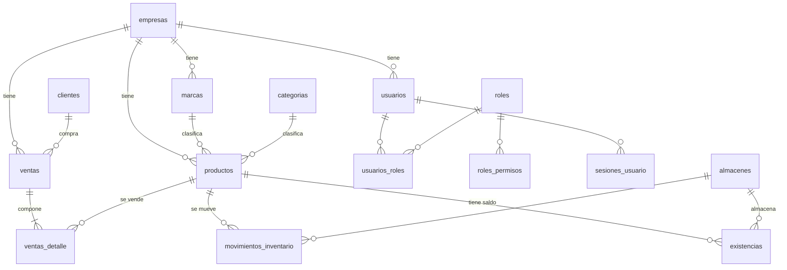

# Convenciones de base de datos

Motor: **SQL Server**. Acceso: EF Core 8 con configuraciones explícitas
(`IEntityTypeConfiguration`), nunca por convención implícita.

## Nombres

| Elemento | Convención | Ejemplo |
|---|---|---|
| Tabla | snake_case, plural | `ventas_detalle`, `movimientos_inventario` |
| Columna | PascalCase (igual que la propiedad C#) | `EmpresaId`, `FechaUtc` |
| Clave primaria | `PK_<tabla>` | `PK_marcas` |
| Clave foránea | `FK_<tabla>_<tabla_referida>` | `FK_productos_marcas` |
| Índice único | `UQ_<tabla>_<columnas>` | `UQ_marcas_empresa_nombre` |
| Índice normal | `IX_<tabla>_<columnas>` | `IX_ventas_empresa_fecha` |
| Restricción de dominio | `CK_<tabla>_<regla>` | `CK_existencias_no_negativa` |
| Valor por defecto | `DF_<tabla>_<columna>` | `DF_marcas_activo` |

Los nombres de índice se declaran a mano con `HasDatabaseName`. Los nombres que genera EF Core
son largos y cambian si cambia una propiedad: cuando hay que leer un plan de ejecución o un
error de violación de índice, un nombre estable y legible vale mucho.

## Columnas obligatorias

| Columna | Dónde | Por qué |
|---|---|---|
| `Id BIGINT IDENTITY` | Toda tabla | `BIGINT` desde el principio: migrar de `INT` con datos en producción es caro |
| `EmpresaId BIGINT` | Toda tabla de negocio | Aislamiento multiempresa ([`../multiempresa.md`](../multiempresa.md)) |
| `Activo BIT` | Entidades que se dan de baja | Baja lógica ([ADR-0007](../decisiones/ADR-0007-baja-logica.md)) |

Todo índice de una tabla de negocio **empieza por `EmpresaId`**: es la columna presente en el
`WHERE` de absolutamente todas las consultas.

## Tipos

| Dato | Tipo | Por qué |
|---|---|---|
| Dinero | `DECIMAL(18,2)` | Nunca `FLOAT`: el binario no representa exactamente los decimales y el error se acumula |
| Costo unitario | `DECIMAL(18,4)` | El costo promedio se recalcula con cada ingreso; dos decimales arrastran error |
| Cantidad de inventario | `DECIMAL(18,4)` | Hay unidades fraccionables |
| Fecha y hora | `DATETIME2(3)` | Siempre UTC. `DATETIME` tiene una precisión rara heredada |
| Texto | `NVARCHAR(n)` con `n` explícito | `NVARCHAR(MAX)` impide indexar y engorda las páginas |
| Booleano | `BIT` con `DEFAULT` | — |
| Enumeración | `INT` con `HasConversion<int>()` | Estable ante renombres en C# |

El `ContextoErp` aplica `decimal(18,2)` por defecto a toda propiedad `decimal` que no declare
otra cosa, para que un olvido no termine en el tipo por defecto del proveedor.

## Integridad

- Claves foráneas con `ON DELETE NO ACTION`. Única excepción: el detalle respecto de su
  cabecera (`ventas_detalle` → `ventas`), donde la línea no tiene existencia propia.
- **Las reglas de unicidad viven en la base**, no solo en el caso de uso. Dos requests
  simultáneos pueden pasar ambos la validación previa; solo la restricción los frena.
- Las restricciones `CHECK` expresan invariantes del dominio que deben valer aunque el código
  falle: `Cantidad >= 0` en existencias, `Cantidad > 0` en movimientos,
  `Estado IN ('COMPLETADA','ANULADA')` en ventas.

## Fechas

Todo se guarda en **UTC**, y las columnas lo dicen en el nombre (`FechaUtc`,
`FechaCreacionUtc`). La conversión a la zona del usuario es responsabilidad de quien presenta,
no de quien almacena: en cuanto se guardan horas locales, cualquier reporte que cruce un cambio
de horario deja de cuadrar.

## Denormalización deliberada

Tres casos, todos documentados donde ocurren:

| Dato duplicado | Dónde | Por qué |
|---|---|---|
| Totales de venta | `ventas` y `ventas_detalle` | Congela el histórico ante cambios de tasa ([ADR-0005](../decisiones/ADR-0005-totales-de-venta.md)) |
| `DescripcionProducto` | `ventas_detalle` | Si el producto se renombra, el documento histórico no cambia |
| `UsuarioNombre` | `log_acciones` | El log sigue siendo legible aunque el usuario se desactive |

Denormalizar sin decir por qué es un error; denormalizar por una razón escrita es una decisión.

## Modelo

`existencias` es una proyección de `movimientos_inventario`, no una tabla independiente que se
edite a mano ([ADR-0008](../decisiones/ADR-0008-inventario-por-movimientos.md)).
