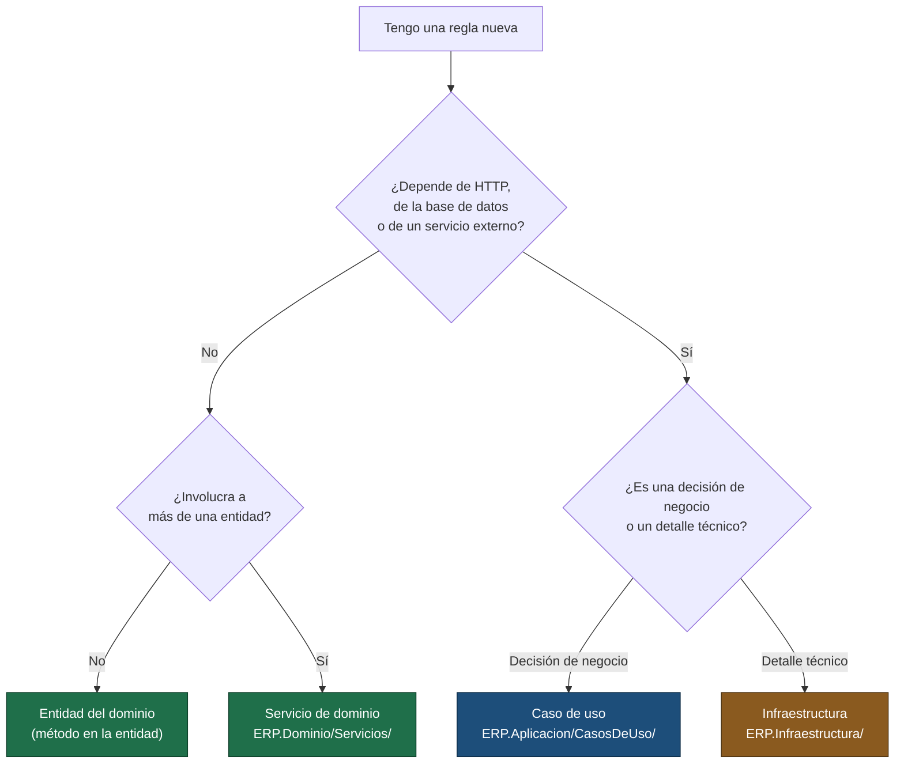

# Arquitectura y reglas de dependencia

Lectura obligatoria antes de modificar el proyecto.

## La regla

```
ERP.Api ──► ERP.Aplicacion ──► ERP.Dominio
                  ▲                 ▲
                  └── ERP.Infraestructura ──┘
```

Las flechas apuntan hacia adentro y no hay excepciones:

| Proyecto | Puede referenciar | No puede referenciar |
|---|---|---|
| `ERP.Dominio` | nada | absolutamente nada: ni EF Core, ni ASP.NET, ni paquetes NuGet |
| `ERP.Aplicacion` | `ERP.Dominio` + abstracciones de DI/Options | EF Core, ASP.NET, cualquier implementación concreta |
| `ERP.Infraestructura` | `ERP.Aplicacion`, `ERP.Dominio` | `ERP.Api` |
| `ERP.Api` | `ERP.Aplicacion`, `ERP.Infraestructura` (solo para registrarla) | — |

El `.csproj` de `ERP.Dominio` está vacío a propósito. Si algún día necesita un paquete, eso es
señal de que la lógica que se está escribiendo no pertenece al dominio.

## Qué va en cada carpeta

### ERP.Dominio — las reglas que serían ciertas aunque no existiera el software

| Carpeta | Contenido |
|---|---|
| `Entidades/` | Entidades del negocio. Anémicas por defecto; con comportamiento cuando el invariante es local a la entidad (`SesionUsuario.EstaVigente`). |
| `ValueObjects/` | Tipos que encapsulan un invariante: `EmpresaId`, `ProductoId`, `Dinero`. |
| `Servicios/` | Reglas que involucran a varias entidades o que son cálculo puro: `CalculadoraTotalesVenta`, `PoliticaInmutabilidadMovimientoInventario`. |
| `Abstracciones/` | Contratos transversales del modelo: `IEntidadMultiEmpresa`. |

**Criterio:** si la regla seguiría siendo cierta con lápiz y papel, va aquí.

### ERP.Aplicacion — qué hace el sistema, orquestado

| Carpeta | Contenido |
|---|---|
| `CasosDeUso/<Modulo>/` | Un manejador por caso de uso, con su comando/consulta y su resultado. |
| `Abstracciones/Entidades/` | `IRepositorio*`: acceso por agregado, para escritura y lectura puntual. |
| `Abstracciones/Consultas/` | `IConsulta*`: read models para reportes y listados agregados. |
| `Abstracciones/Contexto/` | Quién pregunta: empresa, usuario, reloj. |
| `Abstracciones/Servicios/` | Capacidades técnicas que el caso de uso necesita: tokens, hashing, bitácora. |
| `Comun/CodigosError/` | Catálogo de códigos. |
| `Comun/Excepciones/` | Jerarquía de excepciones de negocio. |
| `Comun/Paginacion/` | `SolicitudPaginada` y `ResultadoPaginado<T>`. |
| `Comun/Opciones/` | Configuración tipada del negocio (tasas, catálogos permitidos). |

**La separación `Entidades/` vs `Consultas/`** es deliberada: un reporte que agrega seis meses
de ventas no debe pasar por el repositorio de escritura y materializar agregados completos.
Lee una proyección, en SQL, y devuelve exactamente las columnas que necesita.

### ERP.Infraestructura — cómo se resuelve

| Carpeta | Contenido |
|---|---|
| `Contexto/` | `ContextoErp` (DbContext) y `UnidadDeTrabajoEfCore`. |
| `Persistencia/Configuraciones/` | Un `IEntityTypeConfiguration` por entidad. |
| `Persistencia/Migraciones/` | Scripts SQL versionados. |
| `Repositorios/` | Implementaciones EF Core de `IRepositorio*` y `IConsulta*`. |
| `Seguridad/` | JWT, BCrypt, resolución de empresa y usuario desde claims. |
| `Servicios/` | Reloj del sistema, bitácora de acciones. |
| `ServiciosDominio/` | Implementaciones de contratos que **define el dominio** pero que necesitan persistencia: `ServicioStockProducto`. |
| `InyeccionDependencias/` | El único archivo que conoce abstracciones e implementaciones a la vez. |

#### Transacciones y reintentos

`IUnidadDeTrabajo` recibe la operación como **delegado**
(`EjecutarEnTransaccionAsync(async ct => { ... })`) y no como un par abrir/confirmar. No es
gusto: la conexión declara `EnableRetryOnFailure` para sobrevivir a caídas transitorias de red
y a los failover del servidor, y EF Core **rechaza en tiempo de ejecución** la combinación de
esa estrategia con una transacción abierta a mano —al reintentar tendría que repetir la unidad
completa, no la última sentencia—.

Con la forma de delegado, la operación se ejecuta *dentro* de la estrategia y un reintento
repite todo el bloque desde cero. Es un error que no aparece al compilar ni en las pruebas con
dobles: solo se ve al escribir contra una base real, que es exactamente donde se descubrió.

**Por qué `ServiciosDominio/` está separado de `Repositorios/`:** no es acceso a datos de una
entidad, es una regla del negocio (el saldo es la proyección de los movimientos) que necesita
la base de datos para ejecutarse. El dominio dicta la regla; la infraestructura elige cómo
correrla.

### ERP.Api — traducir HTTP

| Carpeta | Contenido |
|---|---|
| `Controladores/` | Una acción por caso de uso. Sin try/catch, sin validaciones manuales, sin consultas. |
| `Contracts/` | Contratos de entrada y salida. Nunca se expone una entidad de dominio. |
| `Validadores/` | FluentValidation: reglas de **forma** (requerido, largo, rango). |
| `Filtros/` | Comportamiento por acción: validación, auditoría. |
| `Intermediarios/` | Comportamiento por request: correlación, manejo de errores. |
| `Autorizacion/` | RBAC por permisos. |
| `Convenciones/` | Derivación automática de rutas desde el nombre de la clase y del método. |

## Dónde va una regla nueva



Casos límite frecuentes:

- **"El nombre no puede estar duplicado"** → caso de uso. Necesita consultar el estado del
  sistema, así que no es una regla de forma ni una regla puramente local a la entidad.
- **"El nombre no puede superar 120 caracteres"** → validador de la API *y* configuración de
  EF Core. Sí, en dos lugares: uno da un error legible, el otro es la garantía.
- **"El impuesto se calcula sobre la base descontada"** → servicio de dominio. Es cálculo puro.
- **"El stock no puede quedar negativo"** → los tres niveles, por motivos distintos. Ver
  [ADR-0008](decisiones/ADR-0008-inventario-por-movimientos.md).

## Convenciones de nombres

| Elemento | Convención | Ejemplo |
|---|---|---|
| Identificadores | Español | `ManejadorRegistrarVenta` |
| Caso de uso que escribe | `Comando*` + `Manejador*` + `Resultado*` | `ComandoCrearMarca` |
| Caso de uso que lee | `Consulta*` + `Manejador*` + `Resultado*`/`Item*` | `ConsultaBuscarMarcas` |
| Repositorio | `IRepositorio<Entidad>` / `Repositorio<Entidad>EfCore` | `IRepositorioMarca` |
| Read model | `IConsulta<Tema>` / `Consulta<Tema>EfCore` | `IConsultaVentasReporte` |
| Controlador | `Controlador<Modulo>` | `ControladorMarcas` |
| Validador | `Validador<Contrato>` | `ValidadorSolicitudCrearMarca` |
| Configuración EF | `Configuracion<Entidad>` | `ConfiguracionMarca` |
| Prueba | `<ClaseProbada>Tests` | `ManejadorCrearMarcaTests` |
| Método de prueba | `Metodo_Escenario_Resultado` | `ManejarAsync_NombreDuplicado_LanzaConflicto` |
| Ruta HTTP | kebab-case, derivada del nombre | `ControladorAutenticacion.IniciarSesion` → `/api/autenticacion/iniciar-sesion` |
| Tabla | snake_case plural | `ventas_detalle` |
| Índice | `IX_`/`UQ_` + tabla + columnas | `UQ_marcas_empresa_nombre` |

## Cómo se agrega un módulo

Siguiendo la plantilla de Marcas, en este orden:

1. Entidad en `ERP.Dominio/Entidades/` (+ servicio de dominio si hay regla que no es de forma).
2. Códigos de error en `ERP.Aplicacion/Comun/CodigosError/`, con correlativo nuevo.
3. Interfaz de repositorio en `ERP.Aplicacion/Abstracciones/Entidades/`.
4. Comandos, manejadores y resultados en `ERP.Aplicacion/CasosDeUso/<Modulo>/`.
5. Registro en `RegistroAplicacion`.
6. Configuración EF y repositorio en `ERP.Infraestructura/`, y registro en `RegistroInfraestructura`.
7. Migración SQL en `Persistencia/Migraciones/`.
8. Permisos en `ERP.Api/Autorizacion/Permisos.cs` y en la semilla.
9. Contratos, validadores y controlador en `ERP.Api/`.
10. Pruebas en `ERP.Tests/<Modulo>/`.
11. `docs/endpoints.md` y `docs/codigos-error.md`.

El [checklist de endpoint](checklist-endpoint.md) cubre el detalle del paso 9 en adelante.
