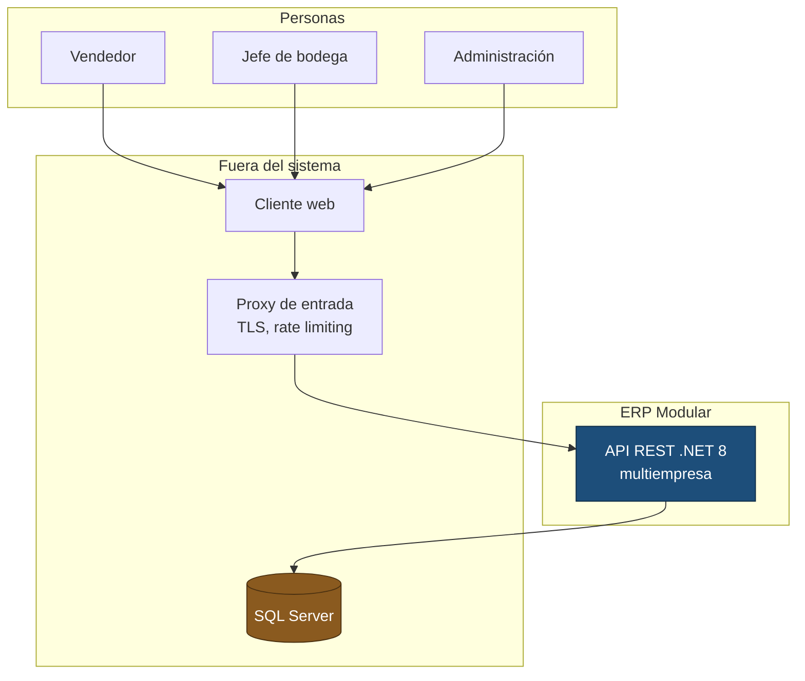
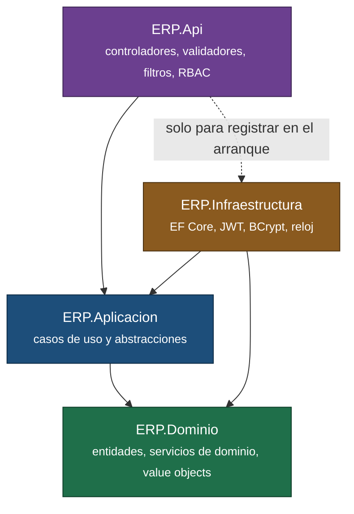
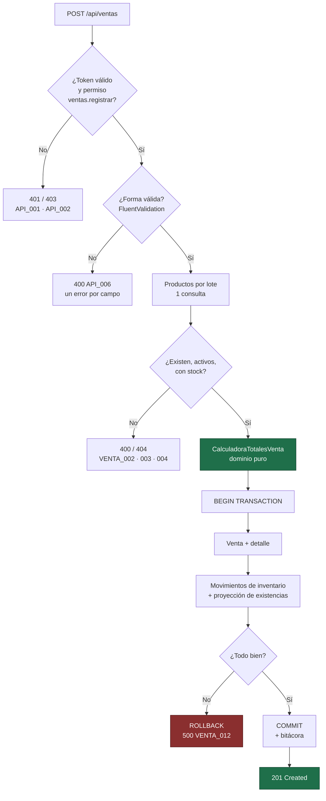
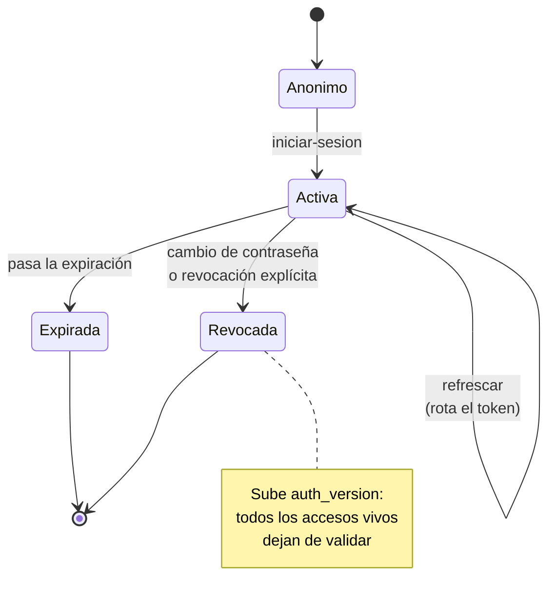

# Diagramas

Todos en Mermaid, versionados junto al código: un diagrama que vive en una herramienta externa
deja de reflejar el sistema a las dos semanas. GitHub los renderiza directamente.

## Contexto

Quién usa el sistema y con qué habla.

El TLS y la protección contra abuso viven en el proxy, no en la aplicación: el contenedor
expone HTTP y no sabe nada de certificados.

## Capas y dependencias

`ERP.Dominio` no tiene ninguna flecha saliente. Es lo que permite que las pruebas corran en un
segundo.

## Registrar una venta

El caso de uso completo, con sus puntos de fallo.

## Ciclo de vida de una sesión

## Dónde vive una regla

El árbol de decisión completo está en [`../arquitectura.md`](../arquitectura.md#dónde-va-una-regla-nueva).
