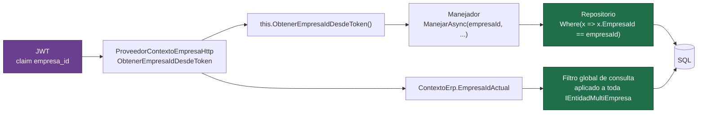

# Aislamiento multiempresa

Todos los clientes comparten las mismas tablas. Una consulta que olvide filtrar por empresa no
falla: devuelve datos de otro cliente. Este documento explica cómo se evita y, sobre todo,
**dónde podría romperse**.

Decisión de fondo: [ADR-0002](decisiones/ADR-0002-multiempresa-por-filtro-global.md).

## El recorrido de `EmpresaId`



**El origen es siempre el token.** Ningún endpoint acepta un `empresaId` por ruta, query o
cuerpo. Si el cliente pudiera proponerlo, no habría aislamiento: bastaría cambiar un número en
el JSON.

## Las dos barreras

### 1. Filtro global de consulta

`ContextoErp.OnModelCreating` recorre el modelo y, a toda entidad que implementa
`IEntidadMultiEmpresa`, le aplica:

```csharp
e => ContextoErp.EmpresaIdActual == 0 || e.EmpresaId == ContextoErp.EmpresaIdActual
```

Cubre el olvido: una consulta escrita sin `Where` sigue sin poder ver datos ajenos.

La rama `== 0` existe para cuando no hay contexto autenticado (arranque, tareas de
mantenimiento). En ese caso el filtro no recorta y el aislamiento recae por completo en la
segunda barrera.

### 2. `empresaId` explícito en cada repositorio

```csharp
Task<Marca?> ObtenerPorIdAsync(long empresaId, long id, CancellationToken ct);
```

La firma obliga a pasarlo. Cubre el caso en que alguien desactive el filtro y, además, hace
evidente al leer el código que la consulta es por tenant.

## Dónde puede romperse

Tres puntos, y los tres están marcados en el código:

| Riesgo | Dónde | Cómo se controla |
|---|---|---|
| `IgnoreQueryFilters()` | `RepositorioUsuarioEfCore`, `RepositorioSesionUsuarioEfCore` | Son las únicas lecturas autorizadas a hacerlo, porque el login ocurre **antes** de que exista empresa. Cada una filtra por `EmpresaId` explícito donde corresponde. |
| Entidad nueva sin `IEntidadMultiEmpresa` | Cualquier entidad nueva | Si no implementa la interfaz, no recibe filtro. Es lo primero que hay que revisar al agregar una entidad. |
| SQL crudo | Migraciones, consultas con `FromSqlRaw` | El filtro global no se aplica a SQL crudo. Toda consulta cruda debe llevar su `WHERE EmpresaId = @empresaId`. |

## Cómo se prueba

[`ERP.Tests/Api/FiltroGlobalMultiempresaTests.cs`](../ERP.Tests/Api/FiltroGlobalMultiempresaTests.cs)
verifica el escenario que importa: una consulta **sin filtro explícito** sobre un contexto con
datos de dos empresas devuelve solo los de la empresa del token.

Es la prueba más importante del repositorio, porque prueba lo que pasa cuando alguien se
equivoca, no lo que pasa cuando todo se escribe bien.

## Comprobarlo a mano

La semilla crea dos empresas justamente para esto:

```bash
# 1. Iniciar sesión como Norte
curl -s -X POST http://localhost:8080/api/autenticacion/iniciar-sesion \
  -H "Content-Type: application/json" \
  -d '{"correo":"admin@norte.cl","contrasena":"Demo.1234"}'

# 2. Buscar marcas con ese token: aparecen las de Norte
curl -s http://localhost:8080/api/marcas/buscar-marcas -H "Authorization: Bearer <token-de-norte>"

# 3. Iniciar sesión como Sur y repetir: la lista viene vacía.
#    Mismo endpoint, misma base, mismas tablas.
```

## Fugas que no son de datos

Un detalle fácil de pasar por alto: pedir un recurso de otra empresa devuelve **404, no 403**.
Responder 403 confirmaría que el recurso existe, que es exactamente la información que no se
quiere filtrar. La misma lógica aplica al login: correo inexistente y contraseña incorrecta
devuelven idéntico código y mensaje.
