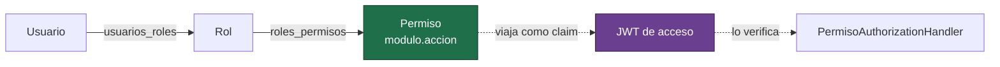
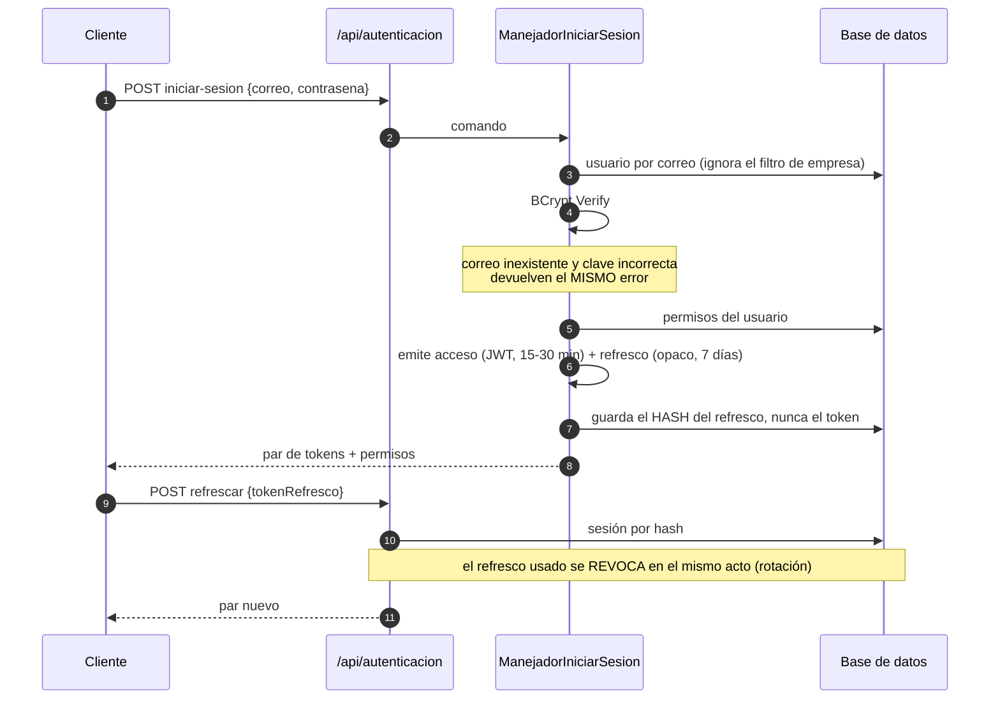

# Seguridad y control de acceso

Decisión de fondo: [ADR-0003](decisiones/ADR-0003-rbac-por-permisos.md).

## Modelo



La unidad de autorización es el **permiso**, no el rol. Los roles son agrupaciones de
permisos y son **datos**: se editan en la base, no en el código. Eso permite que cada cliente
arme los perfiles que necesita sin recompilar.

## Ciclo de una sesión



## Decisiones que vale la pena mirar

| Decisión | Por qué | Dónde |
|---|---|---|
| Los permisos viajan **dentro** del token | Autorizar no cuesta una consulta por request | `ServicioTokensJwt` |
| El acceso dura minutos, no horas | Es el contrapeso de lo anterior: acota la ventana de revocación | `OpcionesJwt` |
| `ClockSkew = TimeSpan.Zero` | Los 5 minutos de tolerancia por defecto de ASP.NET son 5 minutos de acceso después de expirar | `Program.cs` |
| Claim `auth_version` | Permite invalidar de golpe todos los tokens vivos de un usuario incrementando un entero, sin lista negra | `EventosJwtVersionAutenticacion` |
| El refresco es un valor **opaco**, no un JWT | No lleva información: solo sirve para canjearse | `ServicioTokensJwt.GenerarTokenOpaco` |
| Se guarda el **hash** del refresco | Una filtración de la tabla no permite refrescar sesiones | `SesionUsuario.HashTokenRefresco` |
| Rotación en cada refresco | Si alguien reutiliza un refresco viejo, ya no sirve | `ManejadorRefrescarSesion` |
| BCrypt con factor 12 **fijo en el código** | Subir el factor es una decisión de seguridad: debe quedar en el historial de git, no en una variable de entorno | `ServicioHashContrasenasBCrypt` |
| Hash corrupto ⇒ credencial inválida | Nunca un 500: un error de servidor revela más de lo necesario | `ServicioHashContrasenasBCrypt.Verificar` |

## Declarar un permiso en un endpoint

```csharp
[HttpPost]
[AutorizarPermiso(Permisos.Ventas.Registrar)]
public async Task<ActionResult<RespuestaVentaRegistrada>> Registrar(...)
```

El atributo genera el nombre de política `permiso:ventas.registrar`, que
`PermisoPolicyProvider` materializa al vuelo. Agregar un permiso es agregar una constante en
`Permisos.cs` y una fila en `roles_permisos`; no se toca el arranque.

**Los permisos son constantes, nunca literales.** Un permiso mal escrito como literal no falla
al compilar: falla en producción como un 403 que nadie entiende.

## Sincronía código ↔ base de datos

`Permisos.Todos` existe para poder comparar el catálogo del código contra lo que la base tiene
asignado. Un permiso que existe en un atributo pero en ninguna fila de `roles_permisos` produce
un 403 permanente que parece un bug de la aplicación y es un dato faltante.

La semilla ([`20260101_001_datos_semilla.sql`](../ERP.Infraestructura/Persistencia/Migraciones/20260101_001_datos_semilla.sql))
inserta el catálogo inicial, y lleva un comentario recordando que debe coincidir con
`Permisos.cs`. Cada permiso agregado después llega con su propia migración —así lo hace
[`20260102_002_permisos_catalogo.sql`](../ERP.Infraestructura/Persistencia/Migraciones/20260102_002_permisos_catalogo.sql)
con `productos.ver` y `almacenes.ver`—, porque volver a editar la semilla no le agrega nada a
una base que ya la aplicó.

## Secretos

Ninguno está en el repositorio:

| Secreto | De dónde sale |
|---|---|
| `Jwt:ClaveFirma` | Variable de entorno `Jwt__ClaveFirma`. El arranque **falla** si falta o tiene menos de 32 caracteres. |
| `ConnectionStrings:DefaultConnection` | Variable de entorno `ConnectionStrings__DefaultConnection`. |
| Configuración local | `appsettings.Development.json`, que está en `.gitignore`. Hay un `.ejemplo` versionado. |

El fail-fast está en `RegistroInfraestructura.ValidarConfiguracionCritica`: si falta un secreto
o quedó encendido un interruptor de desarrollo, la aplicación **no levanta**. Un contenedor que
no arranca es mucho mejor que uno que arranca inseguro y nadie se entera hasta el incidente.

## Qué no cubre este repositorio

Para ser honesto sobre el alcance:

- No hay rate limiting ni protección contra fuerza bruta en el login. En el sistema real eso
  vive en el proxy de entrada, no en la aplicación.
- No hay segundo factor.
- No hay rotación automática de la clave de firma.
- El TLS lo termina el proxy: el contenedor expone HTTP.
